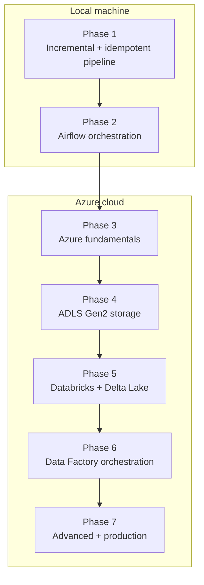

# PySpark → Azure Data Engineering Roadmap

17 Sept 2026 · @VK1836

## Where you are now

You've learned core PySpark syntax (reading data, transformations, joins, window functions, UDFs) and are now applying it to a real project: FinVault, a fintech wallet app with 1,195 seeded users and 540,675+ ledger entries in a local Postgres database. You've run its existing Bronze → Silver → Gold pipeline end-to-end and are currently rebuilding the export step to be incremental and idempotent instead of a full reload every run.

## Roadmap at a glance

Two local phases first, then five phases entirely in Azure.

## Phase 1 — Finish the local pipeline (in progress)

Make the existing FinVault pipeline incremental and safe to re-run, entirely on your machine.

- Add a watermark file tracking the last-processed timestamp per table
- Change the Postgres export query to pull only rows newer than the watermark
- Switch Silver writes from overwrite to append, so history accumulates
- Keep Gold as a full recompute over Silver for now (simplest correct approach)
- Add basic validation: row-count checks, null checks on key columns
- Prove idempotency by running the pipeline twice back-to-back with no new data and confirming row counts don't change

**Duration:** 1–2 weeks part-time. **Done when:** running the pipeline twice in a row produces identical Gold tables, and a fresh Postgres row shows up correctly on the next run without touching old data.

## Phase 2 — Local orchestration with Airflow

Wrap the now-reliable script so it runs on a schedule instead of by hand, still fully local.

- Install Airflow (or the lighter `astro` CLI) locally
- Wrap the pipeline as a single-task DAG, scheduled daily
- Add retries and failure alerting (email or a local notification)
- Expand to a few dependent tasks: export → transform → validate → notify
- Try a manual backfill for a simulated missed day

**Duration:** ~1 week. **Done when:** the pipeline runs on its own schedule and you can explain what happens if a task fails.

## Phase 3 — Azure fundamentals

Learn the cloud platform itself before touching any data service, so later steps aren't fighting unfamiliar infrastructure on top of new data concepts.

- Create an Azure account (free tier / student credit if eligible)
- Core concepts: subscriptions, resource groups, regions
- Identity and access: Azure AD, IAM roles, RBAC basics
- Cost management: budgets, spending alerts — set one before anything else
- Azure CLI (`az`) and the portal, side by side

**Duration:** 3–5 days. **Done when:** you can create and tear down a resource group from the CLI and explain what a budget alert does.

## Phase 4 — Azure Data Lake Storage Gen2

Move pipeline output from local disk to cloud storage — no processing changes yet, just where files live.

- Create a storage account with ADLS Gen2 enabled, containers for bronze/silver/gold
- Compare auth options: access keys (simplest, least secure) vs. SAS tokens vs. managed identity (production-correct)
- Your FinVault repo already has `local/upload_to_azure.py` and `STORAGE_MODE=azure` wired up — use it as the starting point rather than writing this from scratch
- Confirm uploaded files match local output exactly (row counts, file counts)

**Duration:** ~1 week. **Done when:** a pipeline run's output lands in ADLS Gen2 and you can browse it in the Azure portal.

## Phase 5 — Azure Databricks + Delta Lake

Move the actual PySpark processing to a managed cluster, and upgrade from Parquet to Delta so true incremental Gold tables (Approach 2 from earlier) become possible.

- Create a Databricks workspace, connect it to your ADLS Gen2 account
- Port the existing transform functions (`common/transforms/`) into a Databricks notebook or job — same logic, new environment
- Switch table format from Parquet to Delta Lake
- Implement `MERGE` (upsert) for the Gold tables instead of full recompute — this is where the harder incremental-aggregation approach becomes practical
- Compare cluster run time and cost against the local run

**Duration:** 2–3 weeks. **Done when:** the same pipeline logic runs on a Databricks cluster against Delta tables, and Gold tables update via `MERGE` rather than full rebuild.

## Phase 6 — Cloud orchestration

Replace manual notebook runs with proper scheduling and monitoring in Azure.

- Azure Data Factory — chosen as the orchestration tool for this phase
- Schedule triggers and, if relevant, event-based triggers (e.g., run when a new file lands in ADLS)
- Monitoring and alerting via Azure Monitor / Log Analytics
- Failure handling: retries, dead-letter handling for bad batches

**Duration:** 1–2 weeks. **Done when:** the pipeline runs unattended on Azure and you get notified if it fails.

## Phase 7 — Advanced and production topics

The skills that separate a working pipeline from a production-grade one.

- CI/CD: deploy pipeline code/notebooks automatically via GitHub Actions
- Unit testing PySpark transforms (e.g. `chispa`, `pytest`) — your repo already has pipeline tests as a starting reference
- Data quality frameworks (Great Expectations, or dbt-style tests) instead of ad-hoc validation
- Cost optimization: cluster autoscaling, spot/low-priority instances, right-sizing
- Security: Azure Key Vault for secrets, private endpoints, least-privilege RBAC
- Optional capstone marker: the Microsoft **DP-203 (Azure Data Engineer Associate)** certification lines up almost exactly with everything in this roadmap

**Duration:** ongoing — treat this as continuous improvement rather than a phase with an end date.

## Suggested pacing

Assuming part-time study (roughly 5–8 hours/week):

|   |   |   |   |
|---|---|---|---|
|Phase|Focus|Duration|Checkpoint|
|1|Incremental + idempotent local pipeline|1–2 weeks|Two consecutive runs produce identical output|
|2|Local orchestration (Airflow)|1 week|Pipeline runs on a schedule, alerts on failure|
|3|Azure fundamentals|3–5 days|Comfortable in CLI + portal, budget alert set|
|4|Azure Data Lake Storage Gen2|1 week|Pipeline output lands in the cloud|
|5|Databricks + Delta Lake|2–3 weeks|Same pipeline runs on a cluster, Gold uses MERGE|
|6|Cloud orchestration|1–2 weeks|Runs unattended, alerts on failure|
|7|Advanced/production topics|Ongoing|Comfortable discussing CI/CD, testing, cost, security|

Total to a solid intermediate-advanced level: roughly **3–4 months** part-time, assuming Phase 1 is finished first as agreed.